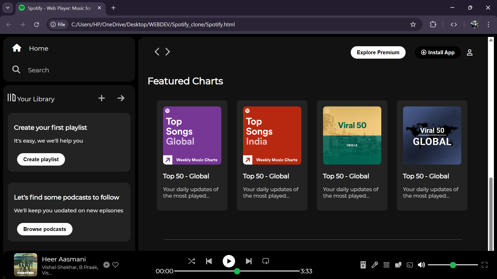

# 🎧 Spotify Clone - Web Player  

A visually stunning Spotify clone built using **HTML** and **CSS**, designed to replicate the classic Spotify web player experience. This project includes a responsive sidebar, music library, sticky navigation, trending songs, and a functional music player, all crafted with clean, modern styling.  

---

## 📝 Features  
- **🎵 Sidebar Navigation:** Home, Search, and Your Library sections for easy navigation.  
- **🔥 Trending Tracks:** Curated sections for recently played and trending songs.  
- **🎛️ Music Player:** Fully styled playback controls, including volume and progress bars.  
- **📱 Responsive Design:** Optimized for various screen sizes using modern CSS.  
- **🔄 Custom Components:** Reusable cards, badges, and control elements.  

---

## 🚀 Tech Stack  
- **HTML**  
- **CSS (Flexbox, Media Queries)**  
- **Font Awesome Icons**  
- **Google Fonts (Montserrat)**  

---

---

## 💡 Future Improvements  
- Adding JavaScript for playlist creation and dynamic content loading.  
- Implementing real-time music streaming and playback features.  
- Improving accessibility and mobile responsiveness.  

---

## 📸 Preview  
  

